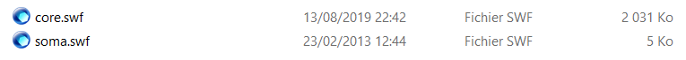
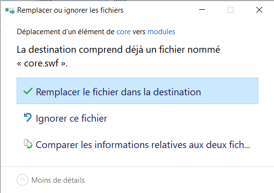

# [Comment modifier son core](https://machral.github.io/)

1 - Téléchargez la dernière version du core sur [cette page](https://machral.github.io/)

2 - Allez dans votre dossier Opium

3 - Allez dans le dossier modules

4 - Glissez le nouveau core dans le dossier et cliquez sur Remplacer le fichier dans la destination

5 - Videz votre cache dans le jeu et c'est fini vous pouvez jouer avec la dernière version du core

**Note :** Cette manipulation est à faire à chaque changement de version
