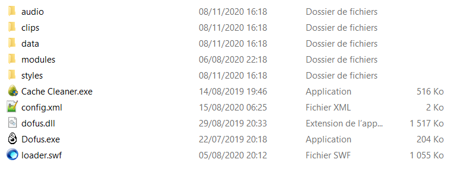

# [Comment modifier son core](https://machral.github.io/)

1 - Télécharger la dernière version du core sur [cette page](https://machral.github.io/)

2 - Aller dans votre dossier Opium

3 - Aller dans le dossier modules

4 - Glisser le nouveau core dans le dossier et cliquer sur Remplacer le fichier dans la destination

5 - Vider votre cache dans le jeu et c'est fini vous pouvez jouer avec la dernière version du core
